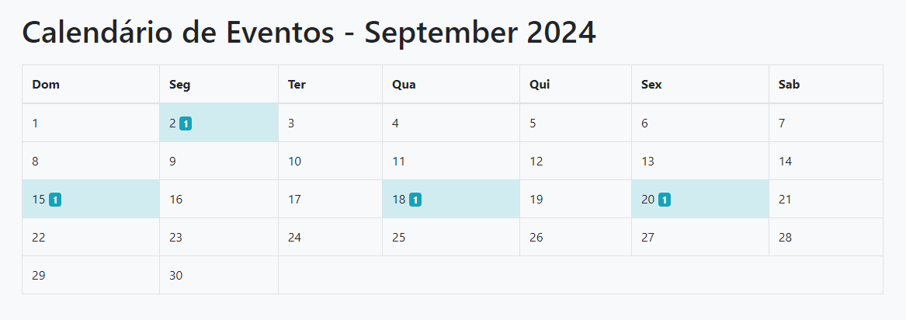

# Um simples Calendário de Eventos

Um script PHP simples de um sistema de agendamento de eventos em formato de calendário que permite consultar o dia e o mês clicando no dia do evento.

## Descrição

Sistema de agendamento de eventos em formato de calendário que permite consultar o dia e o mês clicando no dia do evento, vamos criar uma versão um pouco mais interativa e com menos arquivos, apenas o `index.php` e o `style.css` usando PHP e Bootstrap. O calendário será renderizado em uma tabela, e ao clicar em um dia com evento, um modal exibirá as informações do evento.

## Estrutura do Projeto

Crie os seguintes arquivos:

`index.php`

`style.css`

## 1. Código do `index.php`
  ```PHP
<?php
// Definindo os eventos
$eventos = [
    "2024-09-02" => [
        [
            "titulo" => "Conferência de Tecnologia",
            "descricao" => "Uma conferência sobre as últimas inovações em tecnologia."
        ]
    ],
    "2024-09-15" => [
        [
            "titulo" => "Workshop de PHP",
            "descricao" => "Um workshop prático sobre desenvolvimento em PHP."
        ]
    ],
    "2024-09-18" => [
        [
            "titulo" => "Festival de Música",
            "descricao" => "Um festival com artistas renomados."
        ]
    ],
    "2024-09-20" => [
        [
            "titulo" => "Encontro na Praça Agenor Pinheiro",
            "descricao" => "Um encontro da juventude baixa-grandense."
        ]
    ]
];

// Função para gerar o calendário
function gerarCalendario($mes, $ano, $eventos) {
    // Definindo o primeiro e o último dia do mês
    $primeiroDia = mktime(0, 0, 0, $mes, 1, $ano);
    $diasNoMes = date('t', $primeiroDia);
    $diasDaSemana = date('w', $primeiroDia);

    $calendario = '<table class="table table-bordered"><thead><tr>';
    $diasDaSemanaNomes = ['Dom', 'Seg', 'Ter', 'Qua', 'Qui', 'Sex', 'Sab'];
    foreach ($diasDaSemanaNomes as $dia) {
        $calendario .= "<th>$dia</th>";
    }
    $calendario .= '</tr></thead><tbody><tr>';

    // Adicionando espaços em branco antes do primeiro dia do mês
    for ($i = 0; $i < $diasDaSemana; $i++) {
        $calendario .= '<td></td>';
    }

    // Adicionando os dias do mês
    for ($dia = 1; $dia <= $diasNoMes; $dia++) {
        $dataAtual = sprintf("%04d-%02d-%02d", $ano, $mes, $dia);
        if (isset($eventos[$dataAtual])) {
            $calendario .= '<td class="evento" data-toggle="modal" data-target="#eventoModal" data-data="' . $dataAtual . '">';
            $calendario .= $dia . ' <span class="badge badge-info">' . count($eventos[$dataAtual]) . '</span>';
            $calendario .= '</td>';
        } else {
            $calendario .= '<td>' . $dia . '</td>';
        }

        // Quebrando a linha ao final da semana
        if (($dia + $diasDaSemana) % 7 == 0) {
            $calendario .= '</tr><tr>';
        }
    }

    $calendario .= '</tr></tbody></table>';
    return $calendario;
}

// Mês e ano atual
$mesAtual = date('n');
$anoAtual = date('Y');

?>

<!DOCTYPE html>
<html lang="pt-BR">
<head>
    <meta charset="UTF-8">
    <meta name="viewport" content="width=device-width, initial-scale=1.0">
    <title>Calendário de Eventos</title>
    <link href="https://stackpath.bootstrapcdn.com/bootstrap/4.5.2/css/bootstrap.min.css" rel="stylesheet">
    <link rel="stylesheet" href="style.css">
</head>
<body>

<div class="container mt-5">
    <h1>Calendário de Eventos - <?php echo date('F Y', strtotime("$anoAtual-$mesAtual-01")); ?></h1>
    <?php echo gerarCalendario($mesAtual, $anoAtual, $eventos); ?>
</div>

<!-- Modal -->
<div class="modal fade" id="eventoModal" tabindex="-1" role="dialog" aria-labelledby="eventoModalLabel" aria-hidden="true">
    <div class="modal-dialog" role="document">
        <div class="modal-content">
            <div class="modal-header">
                <h5 class="modal-title" id="eventoModalLabel">Título do Evento</h5>
                <button type="button" class="close" data-dismiss="modal" aria-label="Close">
                    <span aria-hidden="true">&times;</span>
                </button>
            </div>
            <div class="modal-body">
                <div id="eventoDescricao"></div>
            </div>
            <div class="modal-footer">
                <button type="button" class="btn btn-secondary" data-dismiss="modal">Fechar</button>
            </div>
        </div>
    </div>
</div>

<script src="https://code.jquery.com/jquery-3.5.1.slim.min.js"></script>
<script src="https://cdn.jsdelivr.net/npm/@popperjs/core@2.9.2/dist/umd/popper.min.js"></script>
<script src="https://stackpath.bootstrapcdn.com/bootstrap/4.5.2/js/bootstrap.min.js"></script>
<script>
    $('#eventoModal').on('show.bs.modal', function (event) {
        var button = $(event.relatedTarget); // Botão que acionou o modal
        var data = button.data('data'); // Data do evento

        // Obtendo eventos da data
        var descricao = "";
        <?php foreach ($eventos as $dataEvento => $eventoArray): ?>
            if (data === "<?php echo $dataEvento; ?>") {
                <?php foreach ($eventoArray as $evento): ?>
                    descricao += "<strong><?php echo $evento['titulo']; ?></strong><br><?php echo $evento['descricao']; ?><br><br>";
                <?php endforeach; ?>
            }
        <?php endforeach; ?>

        var modal = $(this);
        modal.find('.modal-title').text(data);
        modal.find('#eventoDescricao').html(descricao || "Nenhum evento neste dia.");
    });
</script>

</body>
</html>

  ```
## 2. Código do `style.css`
  ```CSS
 body {
    background-color: #f8f9fa;
}

.table {
    margin-top: 20px;
}

.evento {
    cursor: pointer;
    background-color: #d1ecf1;
}

  ```
## Explicação

`Eventos:` Os eventos são definidos em um array associativo, onde as chaves são as datas e os valores são arrays de eventos para essas datas.

`Gerar Calendário:` A função gerarCalendario cria uma tabela que representa o mês e o ano atual. Para cada dia que tem eventos, ela adiciona uma célula com um badge mostrando a quantidade de eventos.

`Modal` Quando um dia com evento é clicado, o modal é aberto, exibindo os detalhes dos eventos.

`JavaScript:` O script obtém a data do dia clicado e preenche o modal com os eventos correspondentes.

## Como Testar

Salve os arquivos no mesmo diretório em um servidor local (como XAMPP).
Acesse `index.php` no seu navegador.

Com isso, você terá um calendário interativo de eventos que exibe informações detalhadas ao clicar em cada dia. Sinta-se à vontade para personalizar e expandir conforme necessário!
  ```

